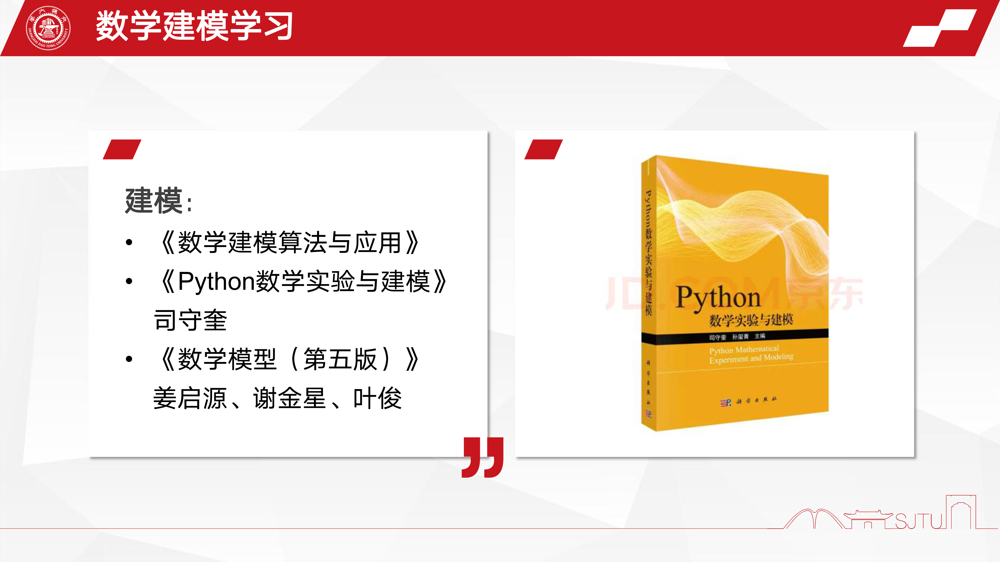

# 数模准备指南
## 工具篇

### matlab

<a href="https://matlabacademy.mathworks.com/cn/?s_tid=acport_mlac_sp_bann">官网学习<a>
！掌握基础用法，可视化，矩阵运算就行，用的时候百度，csdn，google，github 找代码更改即可，要掌握对代码的读改能力

### python
#### 掌握基础用法
#### 矩阵数组运算<a href="https://numpy.org/doc/stable/user/quickstart.html">numpy</a>\
#### 绘图可视化 
<a href="https://matplotlib.org/stable/tutorials/introductory/usage.html">matplotlib官网</a>\
<a href="https://datawhalechina.github.io/fantastic-matplotlib/">推荐学习资料（官网精华中文版）</a>\
——————————————————————————————————————————————————一般掌握前三项即可
#### 做大数据分析【做数据分析类题必用】<a href="https://pandas.pydata.org/docs/getting_started/intro_tutorials/01_table_oriented.html#min-tut-01-tableoriented">pandas</a>\
#### 科学计算（函数，模型，解方程调用包）：,一般比赛时，在官网手册上查看函数API用法<a href="https://docs.scipy.org/doc/scipy/reference/">scipy</a>
#### 数据科学算法
<a href="https://apachecn.gitee.io/ailearning/#/">推荐学习资料</a>这个网站上内容很全，前几章是python基础内容，按需索取就行\

### 可视化

除了前面两个，还有\
<a href="https://www.processon.com/">proceess on</a>\
<a href="https://support.microsoft.com/zh-cn/office/visio-%E5%88%9D%E5%AD%A6%E8%80%85%E6%95%99%E7%A8%8B-bc1605de-d9f3-4c3a-970c-19876386047c?redirectsourcepath=%252fzh-cn%252farticle%252fvisio-%2525e7%25259a%252584%2525e6%252595%252599%2525e7%2525a8%25258b-c8fd9b8b-6e8c-4252-937d-a0eea0cddd94">visio</a>\
其他常用的origin，PPT，excel就不说了

## 理论篇

这个见人见智，按需索取就行

## 写作

<a href="https://www.latexstudio.net/texdoc/#/29?page_id=155">latex</a>\
<a href="https://www.latexlive.com">latex 在线编辑器，忘公式必备</a>

